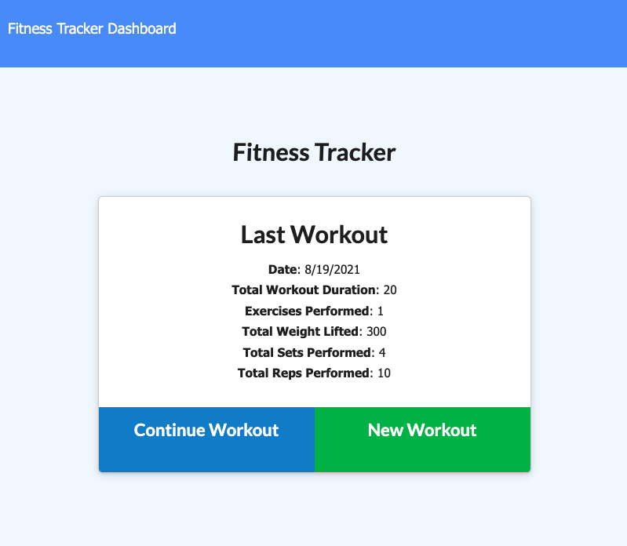
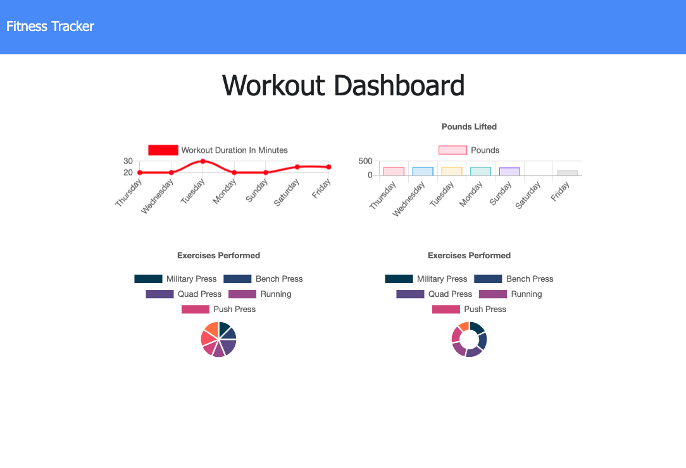

 # workout-tracker
 assignment 17

  [](https://github.com/johnsonr84)
  [](https://github.com/johnsonr84/workout-tracker)
  [](https://github.com/johnsonr84/workout-tracker)
  [](https://choosealicense.com/licenses/mit/)

  ## Table of Contents 
  * [Description](#Description)
  * [User Story](#UserStory)
  * [Project URL](#Project-URL)
  * [Deplyment](#Deployment)
  * [Mock-up](#Mock-up)
  * [Technologies](#Technologies)
  * [Installation](#Installation)
  * [Usage](#Usage)
  * [Credits](#Credits)
  * [License](#License)
  * [Features](#Features)
  * [Tests](#Tests)
  * [Resources](#Resources)
  * [Contact](#Contact)
  * [Designed and built by](#Designed-and-built-by)
  #
  
  ## Description 
  The Workout Tracker app is built with a Mongo database with a Mongoose schema and handle routes with Express. The app allows the user to view, create and track daily workouts, by logging multiple exercises in a workout on a given day. The app will track the users the name, type, weight, sets, reps, and duration of exercise. If the exercise is a cardio exercise, it will track the distance traveled. 

  ## UserStory 
  As a user, I want to be able to view create and track daily workouts. I want to be able to log multiple exercises in a workout on a given day. I should also be able to track the name, type, weight, sets, reps, and duration of exercise. If the exercise is a cardio exercise, I should be able to track my distance traveled.

  ## Project URL
  https://github.com/johnsonr84/workout-tracker/ 

  ## Deployment
  https://dry-castle-85403.herokuapp.com/


  ## Mock-Up
   <table>
    <tr>
      <td>workout-tracker last workout screenshot</td>
    </tr>
    <tr>
      <td></td>
    </tr>
  </table>
  <table>
    <tr>
      <td>gworkout-tracker dashboard screenshot</td>
    </tr>
     <tr>
      <td></td>
    </tr>
  </table>

  ## Technologies 
  ```
  node.js, Mongodb, Mongoose, Express js, Javascript, HTML5, CSS3
  ```

  ## Installation 
  Access to GitHub.com and a code editor such as vscode is necessary. Click the GitHub link provided above to the APP REPO. Click on the green button that says Clone or Download and Choose how you would like to download: using the SSH/HTTPS keys or download the zip file. If using SSH/HTTPS Key: You will copy the link shown and open up either terminal (mac: pre-installed) or gitbash (pc: must be installed). Once the application is open, you will type git clone paste url here. If using Download ZIP: Click on Download Zip. Locate the file and double click it to unzip the file. Locate the unzipped folder and open it.

  ## Usage 
  In order to use this APP, you need terminal (mac: pre-installed) or gitbash (pc: must be installed). You also need to download and install [node.js](https://nodejs.org/en/) and [npm](www.npmjs.com) or [yarn](https://yarnpkg.com/) package manager. Open the cloned REPO in your favorite code editor, and then in terminal, enter the command “npm i“ or “yarn add”  to install the dependencies. You will also need to signup for a free account at [mongodb.com](https://www.mongodb.com/). In addition, make sure to create a .env file on the project root, and input your own Mongodb Atlas connection URI (see .env_example for samples). Now you are ready to start using  the app by entering “npm start” on your terminal or gitbash. If you just want to try how the app works, you can go to the link [here](<heroku deployment url>)

  ## Credits 
  Me, myself and Irene 

  ## License 
  This project is [mit](https://choosealicense.com/licenses/mit/) licensed.

  ## Features
  Coming soon maybe 

  ## Tests
  npm test 

  ## Resources
  * [MongoDB](https://www.mongodb.com/cloud/atlas) 
  * [Mongoose.js](https://mongoosejs.com/)
  * [Heroku](https://www.heroku.com/home)
  * [Choose a License](https://choosealicense.com/)
  * [Badmath](https://img.shields.io/github/languages/top/nielsenjared/badmath)
  * [shields.io](https://shields.io/)
  * [w3schools](https://www.w3schools.com/)
  * [stackoverflow.com](https://stackoverflow.com/)
  * [MongoDB documentation on the $addFields](https://docs.mongodb.com/manual/reference/operator/aggregation/addFields/)
  * [MongoDB documentation on the $sum operator](https://docs.mongodb.com/manual/reference/operator/aggregation/sum/)
  * [Mongoose documentation on aggregate functions](https://mongoosejs.com/docs/api.html#aggregate_Aggregate)
  * [Set Up MongoDB Atlas](../04-Important/MongoAtlas-Setup.md)
  * [Deploy with Heroku and MongoDB Atlas](../04-Important/MongoAtlas-Deploy.md)

  ## Contact
  Email: robertcjohnson1984@gmail.com 

  ## Designed and built by
  Author(s): Rob Johnson  

  GitHub: https://github.com/johnsonr84/ 